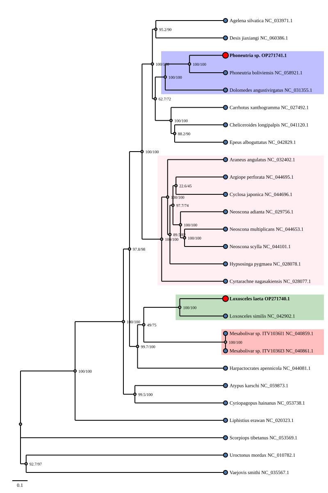
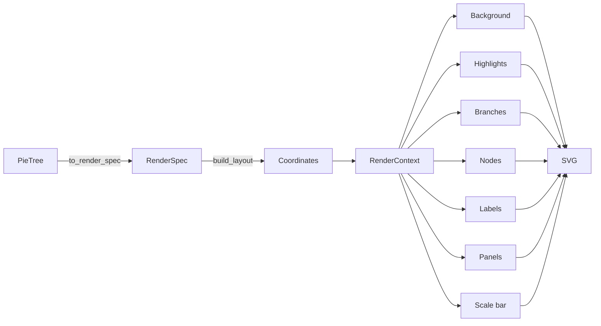

# PieTree

<div align="center">

[](package.json) 
[](https://python.org)
[]()
[]()

</div>

**Metadata-aware phylogenetic tree analysis and visualization for Python.**

> _"Work with trees the way you think about them."_



---

## Features

🌳 **Flexible Tree Building** - Parse Newick, NEXUS, PhyloXML, or build programmatically  
📊 **Metadata-First Design** - Attach arbitrary data to any node  
🔍 **Powerful Queries** - Find clades, filter by metadata, compute distances  
🎨 **Rich Styling** - CSS-like rules, highlighting, custom layouts  
📈 **Multiple Layouts** - Phylogram, cladogram, ultrametric views  
🖼️ **Publication Quality** - SVG vector or high-res PNG/PDF output  
💻 **CLI Tools** - Complete command-line interface for workflows  
✅ **Well-Tested** - 111 tests, comprehensive coverage

---

## Installation

### From PyPI

```bash
pip install pietree
```

### From Source

```bash
git clone https://github.com/PedroCts/pietree.git
cd pietree
pip install -e .
```

### Requirements

- Python 3.10+
- numpy, pandas, biopython, cairosvg

---

## Quick Start

### Python API

```python
import pandas as pd
from pietree import parse_newick

# Load and annotate tree
tree = parse_newick("data/spiders.newick")
samples = pd.read_csv("data/spider_samples.csv", sep=";")
tree.annotate(samples, on="mitogenome_id")

# Style and query
tree.nodes(group="this_study").style(fill="red", radius=5)
tree.tip_labels(group="this_study").suffix(" *").style(font_weight="bold")

tree.metadata("taxonomy").highlight(depth=9, label_position="center_right", palette="tab10")
tree.metadata("taxonomy").label_nodes(show_duplicates=False)

tree.metadata("group").highlight(
    values=["this_study"],
    label="This study",
    colors={"this_study": "#7e7e7e"},
    label_position="center_right",
)
tree.metadata("group").panel(values=["Outgroup"])

tree.savefig("spiders_tree.svg")
```

---

## Why PieTree?

Most phylogenetic libraries focus on either tree manipulation *or* tree rendering. PieTree focuses on the **connection between the two** — and on how metadata bridges them.

The typical workflow elsewhere looks like this: parse the tree, traverse nodes manually, extract tips for a clade of interest, compute the MRCA, pass coordinates to a plotting library, manually style elements. That's a lot of steps before anything biological is expressed.

In PieTree, the same workflow is:

```python
tree.clade_by_taxon("Mammalia").highlight(fill="lightblue")
```

The clade is inferred from hierarchical metadata via longest-common-prefix, styled, and registered for rendering — in one call.

---

## Core Concepts

### The Rendering Pipeline



Layers are composited in order. Highlights render before branches and nodes so they sit underneath the tree. Each layer reads from `RenderContext` — a single source of truth for positions, options, registry state, and registered highlights.

---

## Key Features

### Metadata-First Annotation

Annotate from a DataFrame by any join key — not just node names:

```python
tree.annotate(samples, on="mitogenome_id")
```

Metadata is stored on each node as a `PieMeta` mapping and is available throughout the query and render pipeline.

### Hierarchical Inference

When metadata is stored as lists representing taxonomic paths (e.g. `["Animalia", "Arthropoda", "Insecta"]`), PieTree can infer the value for any internal node via **longest-common-prefix** across its descendant tips — without modifying the tree.

```python
tree.metadata("taxonomy").infer()  # → {node_id: [inferred, path], ...}
```

This inference drives both `.highlight()` and `.label_nodes()` automatically.

### Fluent Querying

```python
tree.nodes(group="this_study")           # NodeSelection
tree.tips                                # NodeSelection (all tips)
tree.tip_labels(country="Brazil")        # LabelSelection
tree.branches()                          # BranchSelection
```

Selections support chained styling, renaming, suffixing, and highlighting.

### Clade Highlights

Highlight clades manually or automatically from metadata:

```python
# Manual
tree.clade(["Tip_A", "Tip_B"]).highlight(fill="#4e79a7", label="Clade I")

# From metadata — one highlight per distinct taxon at depth 1
tree.metadata("taxonomy").highlight(depth=1, palette="set2")
```

### Metadata Panels

Side panels display categorical metadata as grouped bars alongside the tree, automatically positioned after tip labels:

```python
tree.metadata("group").panel(values=["Outgroup"])
```

### Layout Modes

```python
tree.savefig("tree.svg", mode="phylogram")    # branch-length proportional
tree.savefig("tree.png", mode="cladogram")    # equal branch lengths, PNG format
tree.savefig("tree.pdf", mode="ultrametric")  # tips aligned to present, PDF format
```

---

## Philosophy

PieTree is built on three principles.

**Biological semantics.** The API should reflect how biologists think about trees — in terms of clades, taxa, metadata fields, and study groups — not graph traversals and coordinate systems. `tree.clade_by_taxon("Insecta")` is a biological statement; it should work directly.

**Metadata as topology.** In most analyses, what matters is not just the shape of the tree but what the tips *represent*. PieTree treats metadata as a first-class component of the tree object, queryable, inferred, and renderable with the same fluency as topology.

**Fluent, composable operations.** Every operation returns something you can act on further. Selections can be styled, labeled, highlighted. Views can be highlighted, paneled, or iterated. The pipeline from data to publication figure should read like a description of the figure itself.

---

## Roadmap

**Current**
- Newick I/O (read and write)
- Hierarchical metadata inference (longest-common-prefix)
- Automatic clade highlighting from metadata
- Metadata side panels
- Fluent node / branch / label selections
- Phylogram, cladogram, and ultrametric layouts
- Horizontal and vertical orientations
- SVG rendering with layered pipeline
- Scale bar
- Style engine with per-node overrides

**Planned**
- Interactive HTML export
- CLI interface
- Comparative / tanglegram layouts
- Additional annotation geometry (arrows, brackets, icons)
- Analysis modules (diversity, patristic distances, ancestral state)

---

## Contributing

Contributions, bug reports, and feature requests are welcome. If you have ideas for new phylogenetic analyses, visualization styles, or metadata workflows, open an issue or pull request.

---

## License

MIT License.

# Render tree (format auto-detected from extension)
tree.savefig("tree.svg", mode="phylogram")
```

### Command Line

```bash
# Validate tree structure
pietree validate tree.newick

# Render to SVG
pietree render tree.newick -o tree.svg -m cladogram

# Query nodes
pietree query tree.newick "tips" -o json

# Annotate with metadata
pietree annotate tree.newick metadata.csv -o annotated.newick

# Convert formats
pietree convert tree.nex tree.newick
```

---

## Documentation

- **[Documentation Home](docs/index.md)** - Getting started
- **[User Guide](docs/user_guide/)** - Detailed tutorials
- **[API Reference](docs/api_reference/)** - Complete API docs
- **[CLI Reference](docs/user_guide/cli.md)** - Command-line tools
- **[Contributing](CONTRIBUTING.md)** - Development guidelines

---

## Examples

See the [examples/](examples/) directory for complete working examples:

- **Basic Tree** - Simple tree visualization
- **Metadata Annotation** - Adding and using metadata
- **Spiders** - Real phylogenetic analysis with styling
- **Insects** - Complex tree with multiple metadata fields

---

## Architecture

PieTree is organized into focused modules:

```
pietree/
├── core/         # Base abstractions
├── tree/         # Tree structure and operations
├── metadata/     # Metadata system
├── query/        # Selection API
├── style/        # Styling engine
├── render/       # Rendering pipeline
├── io/           # File I/O (Newick, NEXUS, etc.)
└── cli/          # Command-line interface
```

Key design principles:
- **Mixin architecture** for extensibility
- **Metadata as first-class citizen**
- **Lazy evaluation** for performance
- **Abstract base classes** for plugins

---

## Project Status

**Current Version:** 0.1.0b (beta)  
**Status:** Active development

### Roadmap
- [ ] Additional file formats (BEAST, MrBayes)
- [ ] Interactive visualizations
- [ ] Performance optimization
- [ ] Standalone application
- [ ] GUI support

---

## Contributing

We welcome contributions! Please see [CONTRIBUTING.md](CONTRIBUTING.md) for:

- Development setup
- Code standards
- Testing guidelines
- Pull request process

Quick start for contributors:

```bash
# Clone and setup
git clone https://github.com/PedroCts/pietree.git
cd pietree
pip install -e .
pip install pytest pytest-cov

# Run tests
pytest

# Check coverage
pytest --cov=pietree --cov-report=html
```

---

## Citation

If you use PieTree in your research, please cite:

```bibtex
@software{pietree,
  author = {Pedro Côrtes},
  title = {PieTree: Metadata-aware phylogenetic tree visualization},
  year = {2026},
  url = {https://github.com/PedroCts/pietree}
}
```

---

## License

MIT License - see [LICENSE](LICENSE) for details.

---

## Acknowledgments

Built with ❤️ by Pedro Côrtes

---

**PieTree** - Work with phylogenetic trees the way you think about them.
