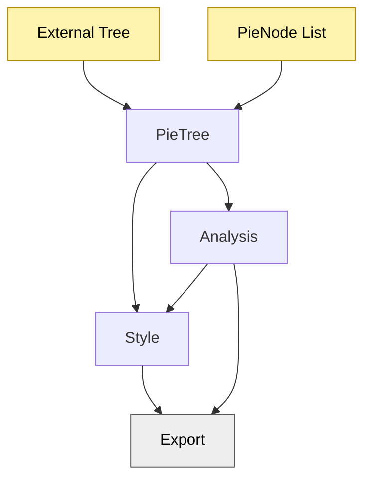
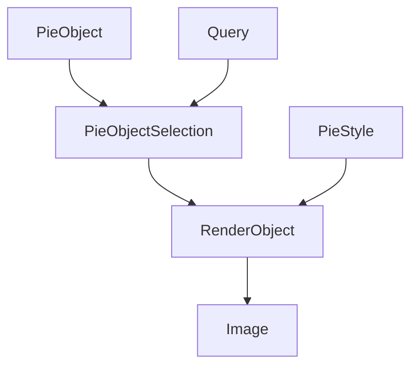

# PieTree

<div align="center">

**Open-source metadata-aware phylogenetic analyser and renderer**

[](package.json)
[](https://python.org)

</div>

****

### Framework Flowchart


****
### Abstraction Layers


****
### Project Structure

```
pietree/
│
├── pyproject.toml
├── README.md
├── LICENSE
├── .gitignore
├── CHANGELOG.md
├── CONTRIBUTING.md
│
├── docs/
│   ├── index.md
│   ├── installation.md
│   ├── quickstart.md
│   ├── api/
│   └── examples/
│
├── tests/
│   ├── test_parser.py
│   ├── test_layout.py
│   ├── test_render.py
│   ├── test_annotations.py
│   └── data/
│       ├── small.treefile
│       └── metadata.csv
│
├── examples/
│   ├── basic_tree.py
│   ├── metadata_tree.py
│   ├── taxonomy_tracks.py
│   └── spiders_example.py
│
├── assets/
│   ├── fonts/
│   ├── palettes/
│   └── icons/
│
├── src/
│   └── pietree/
│       ├── __init__.py
│       │
│       ├── core/
│       ├── io/
│       ├── layout/
│       ├── render/
│       ├── annotation/
│       ├── style/
│       ├── utils/
│       └── cli/
│
└── .github/
    └── workflows/
        └── tests.yml
```